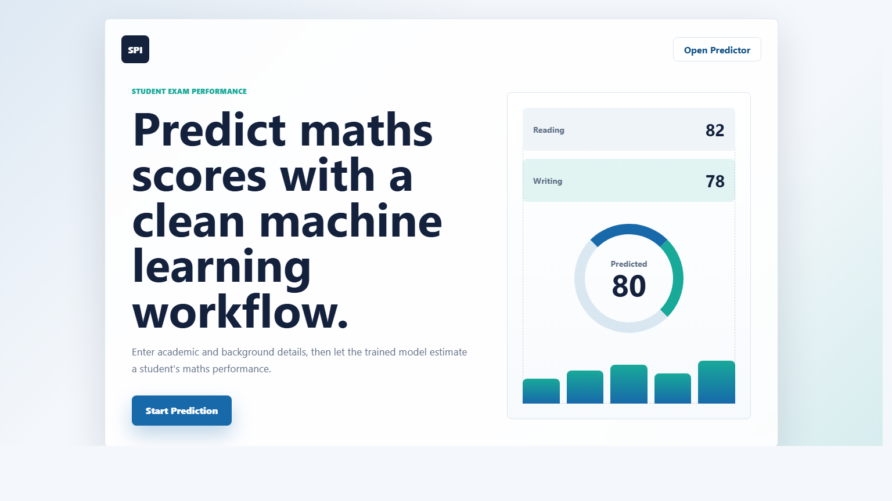
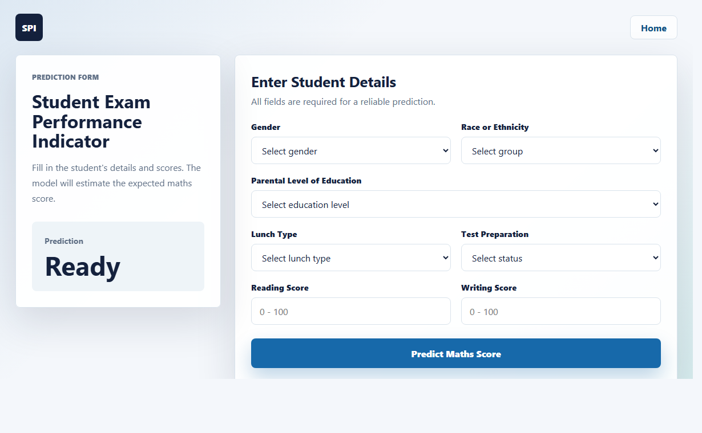

# Student Performance Indicator

A Flask-based machine learning web application that predicts a student's maths score from academic and background details such as gender, race/ethnicity, parental education, lunch type, test preparation status, reading score, and writing score.

## Live Demo

Deployed on Render:

[https://student-performance-indicator-qdmh.onrender.com/](https://student-performance-indicator-qdmh.onrender.com/)

## Screenshots

### Landing Page



### Prediction Form



## Features

- End-to-end machine learning pipeline
- Data ingestion, transformation, model training, and prediction modules
- Multiple regression model comparison
- Hyperparameter tuning with `GridSearchCV`
- Saved preprocessing pipeline and trained model artifacts
- Flask web interface for real-time prediction
- Responsive custom UI with HTML and CSS
- Render deployment support with pinned Python/package versions

## Tech Stack

- Python
- Flask
- scikit-learn
- CatBoost
- XGBoost
- pandas
- NumPy
- dill
- HTML/CSS
- Render

## Project Structure

```text
mlproject/
├── app.py
├── requirements.txt
├── .python-version
├── artifacts/
│   ├── model.pkl
│   ├── preprocessor.pkl
│   ├── train.csv
│   └── test.csv
├── src/
│   ├── components/
│   │   ├── data_ingestion.py
│   │   ├── data_transformation.py
│   │   └── model_trainer.py
│   ├── pipeline/
│   │   └── predict_pipeline.py
│   ├── exception.py
│   ├── logger.py
│   └── utils.py
├── static/
│   ├── style.css
│   └── screenshots/
└── templates/
    ├── index.html
    └── home.html
```

## Local Setup

Clone the repository:

```bash
git clone <your-repository-url>
cd mlproject
```

Create and activate a virtual environment:

```bash
python -m venv venv
venv\Scripts\activate
```

Install dependencies:

```bash
pip install -r requirements.txt
```

Run the Flask app:

```bash
python app.py
```

Open the app in your browser:

```text
http://127.0.0.1:5000/
```

## Model Training

To run the training pipeline:

```bash
python -m src.components.data_ingestion
```

This creates or updates:

```text
artifacts/model.pkl
artifacts/preprocessor.pkl
artifacts/train.csv
artifacts/test.csv
```

## Deployment

The project is deployed on Render.

Recommended Render settings:

```bash
Build Command:
pip install -r requirements.txt
```

```bash
Start Command:
gunicorn app:app
```

The `.python-version` file pins the deployment runtime to Python `3.8`, matching the environment used to create the saved model artifacts.

## Important Notes

- Keep `artifacts/model.pkl` and `artifacts/preprocessor.pkl` available in the repository or deployment environment.
- Pickle files can break when Python or ML library versions change, so dependencies are pinned in `requirements.txt`.
- If deployment fails after changing versions, retrain the model and redeploy the updated artifacts.

## Author

Sahil Patil
